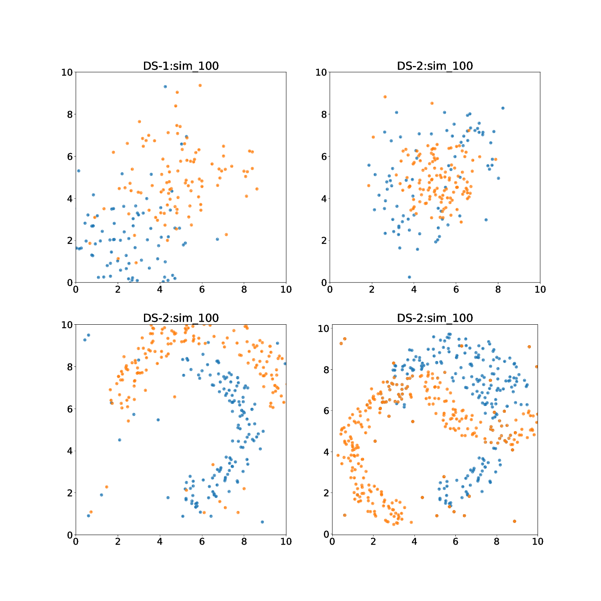

# Simulated data sets for classification

## Introduction 

Classification is one of the most important problems in machine learning 
and there are multiple public data sets, algorithms and frameworks available.
The most common and user  friendly framework is scikit-learn. 

This is far from clear that which of the algorithms is the best for 
a given data set. In fact it is also not clear what we mean by 'the best'
(apart from accuracy there are many other matrices such as precision,
recall, area under ROC curve etc., which are also important). 

Every classification algorithm that has been implemented in scikit-learn 
has multiple choices - mostly about regularization, optimization method
and the choice of hyper-parameters. 
Keeping all these factors in mind there is no point 
in trying  any algorithm for a standard data set in order to understand the 
merits/demerits of a classifier or compare different classifiers and the only 
way out is simulations.

## Data sets 

Here I have a set of synthetic (simulated) data sets that can be used to
understand the working of a classifier and compare different classifiers. 
In order to make the problem I have consider data sets (for binary classification)
with the following structures.

- DS-1. gaussian_2d: Points belonging to different classes are distributed in the form 
   of two well separated two-dimensional Gaussian. The covariance matrices 
   which are used for this purpose have non-zero off diagonal elements 
   which you can easily make out from the distribution. 

- DS-2. annular_2d : The central region belong to one class and outer region 
   another class.
- DS-3. double_arc : The points belonging to different classes are distributed
   along two different arcs.
- DS-4. double_loop: This has  of complex structure. 

Note that in order to make the problems challenging there are enough 'mixing' 
between classes. There are 100 realization for each data in the form of 'csv'
files inside the 'data.tar.gz' file. The first two columns of the data sets 
are feature columns and the third is the target. 

## Contact 

In case you want to ask anything you can let me know at prasad.jayanti@gmail.com.
 
